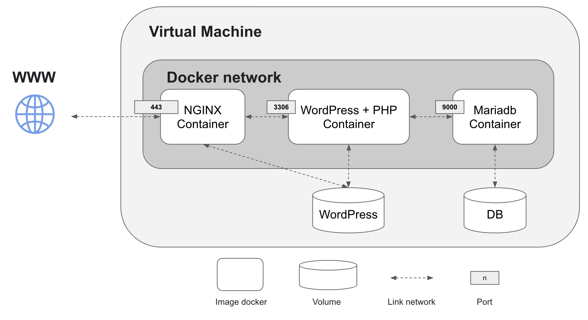
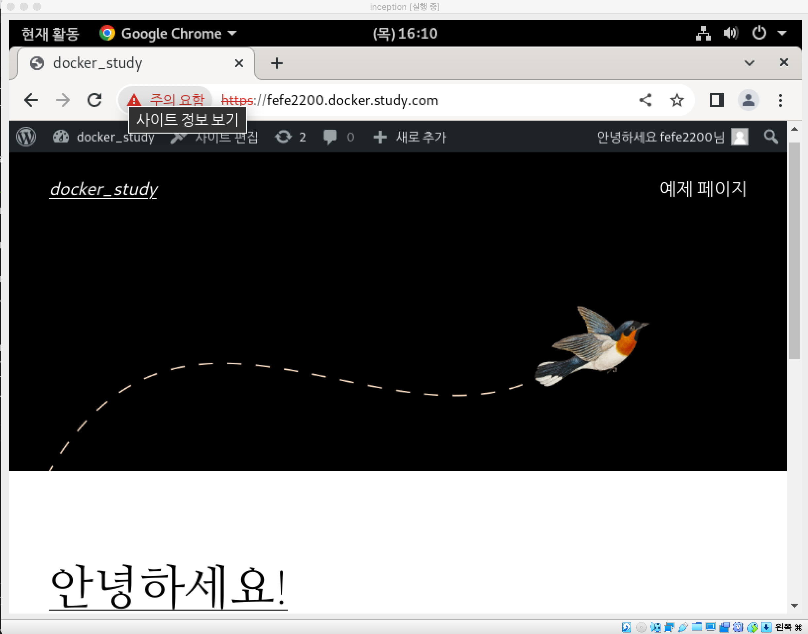

# DockerStudyRearranging
도커를 학습해보자. 간단하게 nginx, wordpress, mariaDB를 사용하여 도커 익히기
기존 DockerStudy private repository의 public 재정리

## 목차
- [구현된 도커 다이어그램](#구현된-도커-환경)
* [구현시 이슈](#구현시-이슈)
+ [실행시 참고사항](#실행시-참고사항)

### 구현된 도커 환경

### 구현시 이슈
1. 워드프레스 컨테이너 실행시 DB 연결 안되던 문제
.env 파일에 등록한 MYSQL_USER 등 필요한 환경 변수 인식을 못하는 문제가 있었습니다.
이유를 찾아보니 도커파일을 빌드해서 테스트 시에는 베쉬환경에서 환경변수가 있는 것을 확인했습니다.
하지만, 이미지 실행시에는 CMD 명령으로 셀스크립트 파일에 있는 exec php-fpm7.3 -F로 실행파일이 PID 1로 하나만 동작하여 환경변수를 못 찾아 디비연동이 안되는 것이였습니다.
이 문제는 스크립트 파일에 있는 것처럼 php conf 파일에 배쉬가 돌아갈 때(exec php-fpm7.3 -F 실행 전에) .env에서 넘겨받은 환경변수를 넣어주면 php-fpm7.3만 실행시 디비연동이 되는 것을 확인할 수 있습니다.

2. 마리아디비 서버 재실행 문제(mysqld_safe문제)
기존에 디비서버를 실행시에 mysql start로 실행 되도록 했는데 이럴 경우, 내부적으로 mysqld_safe이 실행되어 mysqld를 호출해 실행을 하게 된다.
하지만 문제는 mysqld_safe이 mysqld 호출시 생기는 안전하지 않는 문제로 인해 mysqld를 직접 실행하면 이러한 문제를 해결할 수 있다.
다른 경우로는 mysqld실행시 .cnf 파일에서 "[mysqld]"를 따로 설정하지 않아 마리아디비컨테이너가 계속 재실행되는 문제가 있다. 

### 실행시 참고사항
1. 해당 프로젝트를 다운 받은 후 Makefile 실행.
2. 로컬호스트에서 실행시 도메인명을 변경하려면 /etc/hosts(데비안OS  기준)에 로컬호스트에 추가로 도메인명 추가하기.

3. 도메인명 추가 시 /srcs/requirements/nginx/conf/nginx.conf파일에서 server_name값 동일하게 변경해 주기.
4. 도메인명으로 브라우저에서 접속 후 나오는 워드프레스 초기설정 후 사용(단, /srcs/docker-compose.yml에서 volumes:의 device 주소(가상머신 OS)에 해당 파일 만들어 주기).
5. 버전정보 docker -v : 18.09.1, docker-compose -v : 1.29.2

도커 자료는 공식문서와 "시작하세요! 도커/쿠버네티스"-용찬호 지음 책으로 학습